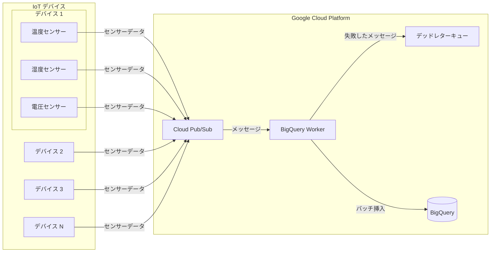

# IoT センサーデータ処理システム

Google Cloud Platform 上に構築された30万個のIoTセンサーデータを処理・監視するシステム。

## ドキュメント
- English: [README.md](README.md)
- 中文: [README-zh.md](README-zh.md)

## 機能

- 30万個のIoTセンサーからのデータをほぼリアルタイムで処理
- センサーの監視とオフライン通知
- 設定可能なバッチデータ処理
- デッドレターキューによるエラー処理
- Terraformによる自動化されたインフラ管理
- GitHub Actionsによる CI/CD

## アーキテクチャ



### アーキテクチャ概要

プロジェクトで使用する GCP リソース：

1. **BigQuery データセットとテーブル**
   - データセット: `sensor_data`
   - テーブル: `sensor_logs` (日付でパーティション化、device_id でクラスタリング)
   - センサーデータの保存

2. **Cloud Pub/Sub**
   - トピック: `sensor-logs-topic`
   - サブスクリプション: `sensor-logs-sub-01`
   - デッドレターキュー: `sensor-logs-dlq`
   - リアルタイムセンサーデータの受信

3. **サービスアカウント**
   - クライアントアプリケーション用
   - Pub/Sub と BigQuery に必要な IAM 権限を含む

## コンポーネント

1. **インフラストラクチャ** (terraform/)
   - Terraform で管理される GCP リソース
   - BigQuery、Pub/Sub、IAM の設定

2. **IoT クライアント** (apps/iot-client/)
   - 複数の IoT デバイスをシミュレート
   - デバイス数と送信頻度を設定可能

3. **BigQuery ワーカー** (apps/bigquery-worker/)
   - Pub/Sub からのメッセージを処理
   - BigQuery へのバッチ挿入
   - デッドレターキューでエラー処理

## 前提条件

- Terraform >= 1.0
- Google Cloud SDK
- Bun >= 1.2.2
- TypeScript >= 5.0.0

## クイックスタート

1. 必要なツールをインストール：
   - [Terraform](https://developer.hashicorp.com/terraform/downloads)
   - [Google Cloud SDK](https://cloud.google.com/sdk/docs/install)

2. プロジェクトをクローンして移動：
   ```bash
   git clone https://github.com/ThaddeusJiang/sensor_logs.git
   cd sensor_logs
   ```

3. GCP 認証を設定：
   ```bash
   gcloud auth application-default login
   ```

4. 初期化とデプロイ：
   ```bash
   cd terraform
   terraform init
   terraform plan
   terraform apply
   ```

5. センサーの初期化：
   ```bash
   bun run apps/bigquery-worker/src/scripts/init-sensors.ts
   ```

6. IoT クライアントを実行、詳細は [apps/iot-client](apps/iot-client) を参照
7. BigQuery ワーカーを実行、詳細は [apps/bigquery-worker](apps/bigquery-worker) を参照

## データモデル

```sql
CREATE TABLE `sensor_data.sensor_logs` (
    `device_id` STRING,
    `sensor_id` STRING,
    `timestamp` TIMESTAMP,
    `temperature` FLOAT64,
    `humidity` FLOAT64,
    `voltage` FLOAT64,
    `error_code` STRING,
    `status` STRING
)
PARTITION BY DATE(`timestamp`)
CLUSTER BY `device_id`, `sensor_id`
```

```sql
CREATE TABLE `sensor_data.sensors`
(
    `device_id` STRING,
    `sensor_id` STRING,
    `created_at` TIMESTAMP,
    `updated_at` TIMESTAMP,
    `status` STRING
)
```

## リソースのクリーンアップ

作成したリソースを削除：
```bash
cd terraform
terraform destroy
```

## コントリビューション

Pull Requests 歓迎です！以下を確認してください：
1. プロジェクト規約に従ったコード
2. ドキュメントの更新
3. 必要なテストの追加

## ライセンス

MIT
