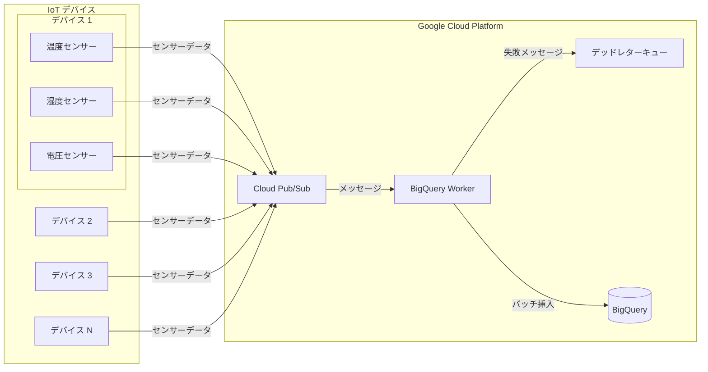

# センサーログ

センサーデータ処理システム。

## ドキュメント
- English: [README.md](README.md)
- 中文: [README-zh.md](README-zh.md)

## アーキテクチャ



## コンポーネント

1. **インフラストラクチャ**
   - Terraform で管理する GCP リソース
   - BigQuery、Pub/Sub、必要な IAM 設定を含む

2. **IoT シミュレーションクライアント (apps/iot-client)**
   - TypeScript アプリケーション
   - 複数の IoT デバイスをシミュレート
   - デバイス数と送信頻度を設定可能

3. **BigQuery Worker (apps/bigquery-worker)**
   - Pub/Sub からのメッセージを処理
   - BigQuery へバッチ挿入
   - デッドレターキューでエラー処理

## データモデル

センサーデータテーブル構造：

```sql
CREATE TABLE `sensor_data.sensor_logs`
(
    `device_id` STRING,
    `sensor_id` STRING,
    `timestamp` TIMESTAMP,
    `temperature` FLOAT64,
    `humidity` FLOAT64,
    `voltage` FLOAT64,
    `error_code` STRING,
    `status` STRING
)
PARTITION BY DATE(`timestamp`)
CLUSTER BY `device_id`, `sensor_id`
```

## クイックスタート

1. 必要なツールをインストール：
   - [Terraform](https://developer.hashicorp.com/terraform/downloads)
   - [Google Cloud SDK](https://cloud.google.com/sdk/docs/install)

2. プロジェクトをクローンして移動：
   ```bash
   git clone https://github.com/ThaddeusJiang/sensor_logs.git
   cd sensor_logs
   ```

3. GCP 認証を設定：
   ```bash
   gcloud auth application-default login
   ```

4. 初期化とデプロイ：
   ```bash
   cd terraform
   terraform init
   terraform plan
   terraform apply
   ```

5. IoT Client を実行、詳細は [apps/iot-client](apps/iot-client) を参照
6. BigQuery Worker を実行、詳細は [apps/bigquery-worker](apps/bigquery-worker) を参照

## プロジェクト構造

```
.
├── README.md
├── apps/
│   ├── bigquery-worker/ # BigQuery データ処理ジョブ
│   │   ├── terraform/   # Terraform 設定
│   ├── iot-client/     # TypeScript シミュレーションクライアント
├── terraform/          # Terraform 設定
└── .gitignore
```

## バージョン要件

- Terraform >= 1.0
- Google Provider >= 6.8.0
- Bun >= 1.2.2
- TypeScript >= 5.0.0

## リソースのクリーンアップ

作成したリソースを削除：
```bash
cd terraform
terraform destroy
```

## コントリビューション

Pull Requests 歓迎です！以下を確認してください：
1. プロジェクト規約に従ったコード
2. ドキュメントの更新
3. 必要なテストの追加

## ライセンス

MIT
