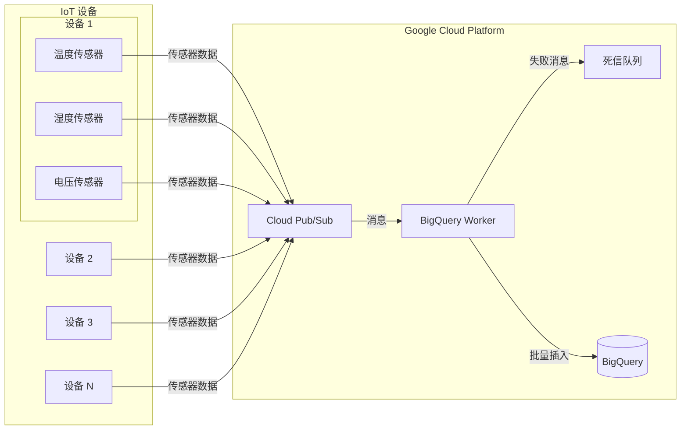

# 传感器日志

传感器数据处理系统。

## 文档
- English: [README.md](README.md)
- 日本語: [README-ja.md](README-ja.md)

## 架构



## 组件

1. **基础设施**
   - 使用 Terraform 管理的 GCP 资源
   - 包括 BigQuery、Pub/Sub 和必要的 IAM 配置

2. **IoT 模拟客户端 (apps/iot-client)**
   - TypeScript 应用
   - 模拟多个 IoT 设备
   - 可配置的设备数量和传输频率

3. **BigQuery Worker (apps/bigquery-worker)**
   - 处理来自 Pub/Sub 的消息
   - 批量插入到 BigQuery
   - 使用死信队列处理错误

## 数据模型

传感器数据表结构：

```sql
CREATE TABLE `sensor_data.sensor_logs`
(
    `device_id` STRING,
    `sensor_id` STRING,
    `timestamp` TIMESTAMP,
    `temperature` FLOAT64,
    `humidity` FLOAT64,
    `voltage` FLOAT64,
    `error_code` STRING,
    `status` STRING
)
PARTITION BY DATE(`timestamp`)
CLUSTER BY `device_id`, `sensor_id`
```

## 快速开始

1. 安装必要工具：
   - [Terraform](https://developer.hashicorp.com/terraform/downloads)
   - [Google Cloud SDK](https://cloud.google.com/sdk/docs/install)

2. 克隆并进入项目：
   ```bash
   git clone https://github.com/ThaddeusJiang/sensor_logs.git
   cd sensor_logs
   ```

3. 配置 GCP 认证：
   ```bash
   gcloud auth application-default login
   ```

4. 初始化并部署：
   ```bash
   cd terraform
   terraform init
   terraform plan
   terraform apply
   ```

5. 运行 IoT Client，详见 [apps/iot-client](apps/iot-client)
6. 运行 BigQuery Worker，详见 [apps/bigquery-worker](apps/bigquery-worker)

## 项目结构

```
.
├── README.md
├── apps/
│   ├── bigquery-worker/ # BigQuery 数据处理作业
│   │   ├── terraform/   # Terraform 配置
│   ├── iot-client/     # TypeScript 模拟客户端
├── terraform/          # Terraform 配置
└── .gitignore
```

## 版本要求

- Terraform >= 1.0
- Google Provider >= 6.8.0
- Bun >= 1.2.2
- TypeScript >= 5.0.0

## 清理资源

删除所有创建的资源：
```bash
cd terraform
terraform destroy
```

## 贡献指南

欢迎提交 Pull Requests！请确保：
1. 代码符合项目规范
2. 更新相关文档
3. 添加必要的测试

## 许可证

MIT
