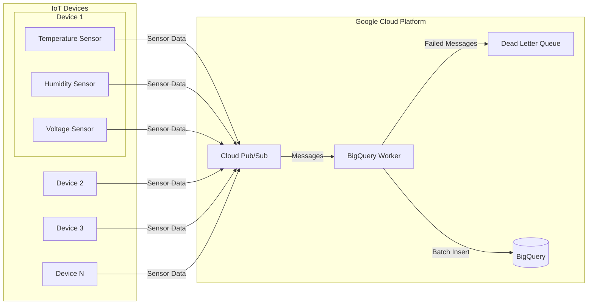

# Sensor Logs

Sensor logs data processing.

## Documentation
- 中文: [README-zh.md](README-zh.md)
- 日本語: [README-ja.md](README-ja.md)

## Architecture



## Components

1. **Infrastructure**
   - GCP resources managed with Terraform
   - Includes BigQuery, Pub/Sub, and necessary IAM configurations

2. **IoT Simulation Client (apps/iot-client)**
   - TypeScript application
   - Simulates multiple IoT devices
   - Configurable device count and transmission frequency

3. **BigQuery Worker (apps/bigquery-worker)**
   - Processes messages from Pub/Sub
   - Batch inserts into BigQuery
   - Handles errors with Dead Letter Queue

## Architecture Overview

The project creates and uses the following GCP resources:

1. **BigQuery Dataset & Table**
   - Dataset: `sensor_data`
   - Table: `sensor_logs` (partitioned by day, clustered by device_id)
   - Stores processed sensor data

2. **Cloud Pub/Sub**
   - Topic: `sensor-logs-topic`
   - Subscription: `sensor-logs-sub-01`
   - Dead Letter Queue: `sensor-logs-dlq`
   - Receives real-time sensor data

3. **Service Account**
   - Used for client applications
   - Includes necessary IAM permissions for Pub/Sub and BigQuery

## Data Model

Sensor data table structure:

```
CREATE TABLE `sensor_data.sensor_logs`
(
    `device_id` STRING,
    `sensor_id` STRING,
    `timestamp` TIMESTAMP,
    `temperature` FLOAT64,
    `humidity` FLOAT64,
    `voltage` FLOAT64,
    `error_code` STRING,
    `status` STRING
)
PARTITION BY DATE(`timestamp`)
CLUSTER BY `device_id`, `sensor_id`
```

## Quick Start

### Infrastructure Deployment

1. Install prerequisites:
   - [Terraform](https://developer.hashicorp.com/terraform/downloads)
   - [Google Cloud SDK](https://cloud.google.com/sdk/docs/install)

2. Clone and enter the project:
   ```bash
   git clone https://github.com/ThaddeusJiang/sensor_logs.git
   cd sensor_logs
   ```

3. Configure GCP authentication:
   ```bash
   gcloud auth application-default login
   ```

4. Initialize and deploy:
   ```bash
   cd terraform

   terraform init
   terraform plan
   terraform apply
   ```

5. Run IoT Client, detail in [apps/iot-client](apps/iot-client)
6. Run BigQuery Worker, detail in [apps/bigquery-worker](apps/bigquery-worker)

## Project Structure

```
.
├── README.md
├── apps/
│   ├── bigquery-worker/ # BigQuery data processing jobs
│   │   ├── terraform/ # Terraform configuration
│   ├── iot-client/   # TypeScript simulation client
├── terraform/ # Terraform configuration
└── .gitignore
```

## Performance Optimization

1. BigQuery Table Optimization:
   - Daily partitioning (timestamp)
   - Clustering by device_id
   - Query performance and cost optimization

2. Client Optimization:
   - Batch message sending
   - Configurable retry mechanism
   - Error handling and logging

## Security Considerations

1. Service Account Permissions:
   - Follows principle of least privilege
   - Main permissions:
     - `roles/pubsub.publisher`
     - `roles/bigquery.dataEditor`

2. Authentication:
   - Uses service account key files
   - Supports environment variables

## Version Requirements

- Terraform >= 1.0
- Google Provider >= 6.8.0
- Bun >= 1.2.2
- TypeScript >= 5.0.0

## Resource Cleanup

To delete all created resources:
```bash
cd terraform

terraform destroy
```

## Contributing

Pull Requests are welcome! Please ensure:
1. Code follows project standards
2. Documentation is updated
3. Tests are added as needed

## License

MIT
