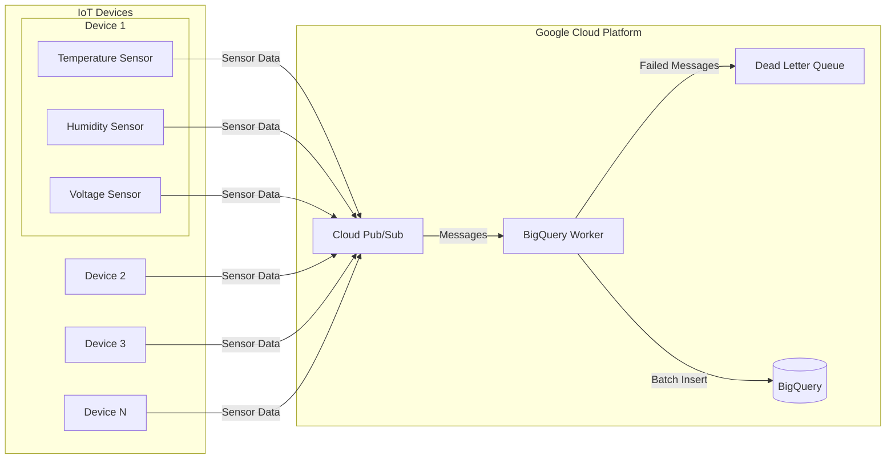

# IoT Sensor Data Processing System

A system for processing and monitoring data from 300,000 IoT sensors, built on Google Cloud Platform.

## Documentation
- 中文: [README-zh.md](README-zh.md)
- 日本語: [README-ja.md](README-ja.md)

## Features

- Near real-time data processing from 300,000 IoT sensors
- Sensor monitoring and offline alerts
- Batch data processing with configurable settings
- Error handling with Dead Letter Queue
- Automated infrastructure management with Terraform
- CI/CD with GitHub Actions

## Architecture



### Architecture Overview

The project creates and uses the following GCP resources:

1. **BigQuery Dataset & Table**
   - Dataset: `sensor_data`
   - Table: `sensor_logs` (partitioned by day, clustered by device_id)
   - Stores processed sensor data

2. **Cloud Pub/Sub**
   - Topic: `sensor-logs-topic`
   - Subscription: `sensor-logs-sub-01`
   - Dead Letter Queue: `sensor-logs-dlq`
   - Receives real-time sensor data

3. **Service Account**
   - Used for client applications
   - Includes necessary IAM permissions for Pub/Sub and BigQuery

## Components

1. **Infrastructure** (terraform/)
   - GCP resources managed with Terraform
   - BigQuery, Pub/Sub, and IAM configurations

2. **IoT Client** (apps/iot-client/)
   - Simulates multiple IoT devices
   - Configurable device count and transmission frequency

3. **BigQuery Worker** (apps/bigquery-worker/)
   - Processes messages from Pub/Sub
   - Batch inserts into BigQuery
   - Handles errors with Dead Letter Queue


## Prerequisites

- Terraform >= 1.0
- Google Cloud SDK
- Bun >= 1.2.2
- TypeScript >= 5.0.0

## Quick Start

1. Install prerequisites:
   - [Terraform](https://developer.hashicorp.com/terraform/downloads)
   - [Google Cloud SDK](https://cloud.google.com/sdk/docs/install)

2. Clone and enter the project:
   ```bash
   git clone https://github.com/ThaddeusJiang/sensor_logs.git
   cd sensor_logs
   ```

3. Configure GCP authentication:
   ```bash
   gcloud auth application-default login
   ```

4. Initialize and deploy:
   ```bash
   cd terraform
   terraform init
   terraform plan
   terraform apply
   ```

5. Initialize sensors:
   ```bash
   bun run apps/bigquery-worker/src/scripts/init-sensors.ts
   ```

6. Run IoT Client, see details in [apps/iot-client](apps/iot-client)
7. Run BigQuery Worker, see details in [apps/bigquery-worker](apps/bigquery-worker)

## Data Model

```sql
CREATE TABLE `sensor_data.sensor_logs` (
    `device_id` STRING,
    `sensor_id` STRING,
    `timestamp` TIMESTAMP,
    `temperature` FLOAT64,
    `humidity` FLOAT64,
    `voltage` FLOAT64,
    `error_code` STRING,
    `status` STRING
)
PARTITION BY DATE(`timestamp`)
CLUSTER BY `device_id`, `sensor_id`
```

```sql
CREATE TABLE `sensor_data.sensors`
(
    `device_id` STRING,
    `sensor_id` STRING,
    `created_at` TIMESTAMP,
    `updated_at` TIMESTAMP,
    `status` STRING
)
```

## Resource Cleanup

To delete all created resources:
```bash
cd terraform
terraform destroy
```

## Contributing

Pull Requests are welcome! Please ensure:
1. Code follows project standards
2. Documentation is updated
3. Tests are added as needed

## License

MIT
