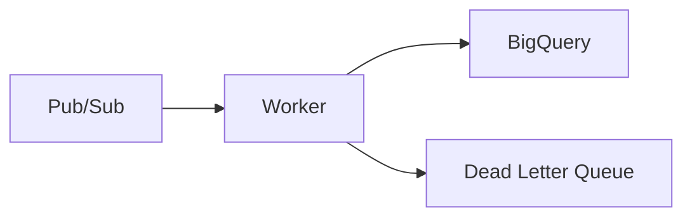

# BigQuery Worker

A worker service that processes sensor data from Pub/Sub and stores it in BigQuery. Part of the IoT data processing infrastructure.

## Features

- Batch processing of sensor data
- Configurable batch size and timeout
- Error handling with Dead Letter Queue
- Graceful shutdown handling
- TypeScript implementation with Bun runtime
- Cloud Run job deployment
- GitHub Actions CI/CD ready

## Architecture



## Prerequisites

- Bun >= 1.2.2
- Google Cloud service account with necessary permissions:
  - `roles/pubsub.subscriber`
  - `roles/bigquery.dataEditor`
  - `roles/run.invoker` (for Cloud Run)

## Configuration

Environment variables:
```env
GOOGLE_CLOUD_PROJECT=your-project-id
GOOGLE_APPLICATION_CREDENTIALS=path/to/service-account-key.json
```

Application settings (in `src/pipeline.ts`):
```typescript
const config = {
    projectId: process.env.GOOGLE_CLOUD_PROJECT,
    subscriptionName: 'sensor-logs-sub-01',
    datasetId: 'sensor_data',
    tableId: 'sensor_logs',
    batchSize: 100,        // Number of messages to batch
    batchTimeout: 10000,   // Batch timeout in milliseconds
};
```

## Development

1. Install dependencies:
```bash
bun install
```

2. Set up service account:
```bash
# Create keys directory if it doesn't exist
mkdir -p keys

# Copy your service account key file
cp /path/to/service-account-key.json keys/
```

3. Run locally:
```bash
bun start
```

4. Run in development mode with hot reload:
```bash
bun dev
```

## Deployment

The service is deployed as a Cloud Run job using Terraform:

1. Navigate to terraform directory:
```bash
cd terraform
```

2. Initialize Terraform:
```bash
terraform init
```

3. Apply configuration:
```bash
terraform apply
```

### Container Image

The service is containerized using the following Dockerfile:
```dockerfile
FROM oven/bun:1.0.30
WORKDIR /app
COPY package.json ./
RUN bun install
COPY src ./src
ENV LISTEN_ON_PORT=false
CMD ["bun", "start"]
```

## Performance Considerations

- Uses batch processing to optimize BigQuery insertions
- Configurable batch size and timeout for optimal performance
- Implements retry mechanism for failed messages
- Dead Letter Queue for handling persistent failures
- Leverages Bun's high-performance runtime
- Cloud Run auto-scaling capabilities

## Monitoring

The service logs important events:
- Batch processing results
- Error conditions
- Subscription status
- Graceful shutdown process

### Key Metrics

- Messages processed per second
- Batch processing latency
- Error rate
- BigQuery insertion latency

## Error Handling

1. Message Processing Errors:
   - Failed messages are sent to Dead Letter Queue
   - Configurable retry attempts
   - Error logging with stack traces

2. BigQuery Errors:
   - Batch insertion retries
   - Error reporting with detailed failure reasons
   - Data validation before insertion

## Contributing

1. Fork the repository
2. Create your feature branch
3. Commit your changes
4. Push to the branch
5. Create a Pull Request

## Related Services

- [IoT Client](../iot-client/README.md) - Simulates IoT devices and sends data
- Main [Infrastructure](../../terraform/README.md) - Core infrastructure configuration

## License

MIT
